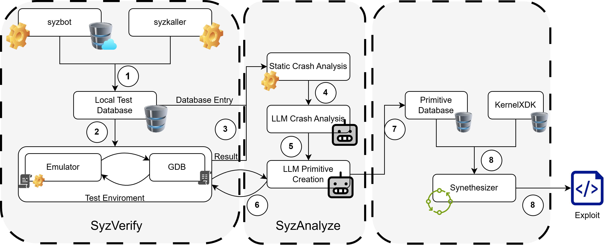

# Syzploit: Syzbot Repro Analyzer

Syzploit automates reproducing Syzkaller-reported kernel bugs, collecting dynamic analysis from both kernel and userspace, and **synthesizing exploit code** from vulnerability analysis. It orchestrates QEMU/Cuttlefish, GDB remote sessions, LLM-powered analysis, and PDDL-based exploit planning to generate working C exploit code.



The diagram shows the flow: SyzVerify -> SyzAnalyze -> Synthesizer -> Exploit Code.

## Features

- **SyzVerify**: Reproduce syzkaller bugs on QEMU/Cuttlefish with GDB tracing
- **SyzAnalyze**: Static and dynamic crash analysis with LLM-powered vulnerability classification
- **Synthesizer**: PDDL-based exploit planning and LLM-powered C code generation
- **Pipeline**: End-to-end automation from bug ID to exploit binary

## Docker

You can run kexploit in a docker container. The Dockerfile is provided in the repository. We also provide a script to run everything once the docker container is built.
To build the docker image, run:
```sh
./build
```
To run the docker container, you can use the provided script:
```sh
./set-env
```
This will mount the current `syzploit` directory to `/workspace/syzbot-repro` in the container, match the network to the host network, and then also run it in user mode so all of the data collected can be accessed from the host machine.

## LLM Integration
Syzploit integrates with OpenAI's GPT models to assist in analyzing kernel bugs through the use of LiteLLM. It generates prompts based on crash data and dynamic analysis, and uses the model's output to identify exploitability, preconditions, postconditions, and path constraints. The LLM is also used by the Synthesizer to generate exploit C code.

To enable this you will need to set your OpenAI API key. There are multiple ways to configure it:

1. **Environment variable** (recommended):
```sh
export OPENAI_API_KEY=your_api_key_here
```

2. **`.env` file** in the working directory:
```sh
echo "OPENAI_API_KEY=your_api_key_here" > .env
```

## Cuttlefish Setup (Optional)

Start the cuttlefish emulator on cuttlefish server, and run adb once to start adb daemon:
```sh
cd /home/jack/cuttlefish_images/aosp_android13_cgi/cf
HOME=$PWD ./bin/launch_cvd -kernel_path=/home/jack/ingots/kernel/Image -initramfs_path=/home/jack/ingots/kernel/initramfs.img
./bin/adb shell
```
The above command starts ingots kernel 5.10.101, but there are many different kernel versions on cuttlefish server.

Setup ssh port forwarding for adb on local machine running kexploit:
```sh
ssh -L localhost:5037:localhost:5037 cuttlefish-user@cuttlefish-host
```

`uv run syzploit test <bug_id>` can now be used to test syzkaller bugs.

### Remote Cuttlefish with Automatic Start/Stop

For testing on remote Cuttlefish servers where you want automatic instance management, use the `test-cuttlefish` command:

```sh
# Test on remote Cuttlefish with automatic start/stop (non-persistent mode)
uv run syzploit test-cuttlefish <bug_id> --syzkall-kernel upstream \
    --ssh-host cuttlefish-server --ssh-user myuser \
    --setup-tunnels --no-persistent \
    --start-cmd "cd ~/cf && ./gdb_run.sh 5" \
    --stop-cmd "cd ~/cf && ./stop.sh 5"

# Test on already-running remote Cuttlefish (persistent mode)
uv run syzploit test-cuttlefish <bug_id> --syzkall-kernel upstream \
    --ssh-host cuttlefish-server --ssh-user myuser \
    --setup-tunnels --persistent --already-running
```

The `--setup-tunnels` option automatically sets up SSH port forwarding for:
- **ADB server** (local 5037 → remote 5037): Allows local `adb` commands to work
- **GDB** (local 1234 → remote 1234): Allows kernel GDB attachment to crosvm

## Running

Run `uv run syzploit` to run syzploit. There are various commands and subcommands that can be run (see `uv run syzploit --help`).
### Project Layout
- `src/syzploit/` — main Python package
  - `main.py` — CLI entry and command routing
  - `SyzVerify/` — validation and dynamic analysis
    - `dynamic.py` — orchestrates QEMU/Cuttlefish, kernel GDB, and userspace `gdbserver`; collects events and writes JSON
    - `gdb.py` — **automated kernel GDB tracing script**; tracks allocs/frees, auto-installs breakpoints on boot, supports aarch64 and x86_64
    - `userspace_gdb.py` — userspace tracing via gdbserver; monitor-only mode supported
    - `run_bug.py` — VM boot + repro execution + artifact management
    - `bug_db.py` — local metadata for syzbot bugs
  - `SyzAnalyze/` — crash post-processing
    - `crash_analyzer.py` — parses crash logs and correlates with runtime events
  - `Synthesizer/` — exploit synthesis from primitives
    - `synth.py` — main orchestration module
    - `domains/` — PDDL domain definitions for Linux/Android kernel exploits
    - `stitcher/` — code generation from PDDL plans
    - `adapters/` — primitive extraction from analysis results
  - `syzploit_data/` — downloaded syzbot bug data
  - `syzkall_crashes/` — output crash analyses and JSON artifacts

## SyzVerify: Dynamic Analysis

SyzVerify automates dynamic analysis of kernel bugs by orchestrating VM execution, kernel GDB tracing, and optional userspace gdbserver tracing. It collects memory allocation/free events and watchpoint hits, exporting structured JSON for further analysis.

### Key Capabilities
- Kernel GDB tracing: attaches to `qemu` or device's kgdb over TCP; supports monitor-only tracing and deferred breakpoints when early pages aren't mapped.
- Userspace tracing: optional `gdbserver` attach to the repro process; records watchpoints and RIP events without pausing (monitor-only).
- KASLR-aware resolution: uses `System.map` and KASLR slide to compute runtime addresses when symbols are stripped; defers address breakpoints until memory is accessible.
- Unified outputs: exports `events`, `allocations`, and `frees` as JSON, plus raw logs.

### Automated GDB Kernel Tracing (`gdb.py`)

The GDB tracing script provides **fully automated** kernel memory tracing for vulnerability analysis. It tracks all `kmalloc`/`kfree` operations and crash stack functions without manual intervention.

#### Supported Platforms
- **aarch64** (Cuttlefish/Android emulator)
- **x86_64** (QEMU)

#### How It Works

1. **Script loads** → Sets up a boot watcher breakpoint on `start_kernel`
2. **User runs `continue`** → Kernel boots normally
3. **Kernel hits `start_kernel`** → Boot watcher auto-installs all tracing breakpoints
4. **Tracing active** → All alloc/free events logged, execution continues automatically
5. **On exit** → Results exported to JSON

#### GDB Commands

| Command | Description |
|---------|-------------|
| `syz_status` | Show current tracing status (events captured, breakpoints installed) |
| `syz_export [path]` | Export results to JSON file |
| `syz_install_breakpoints` | Manually install breakpoints (if boot watcher didn't trigger) |
| `syz_load_config <path>` | Load crash stack functions from JSON config |
| `syz_trace_summary` | Show last 50 recorded events |

#### GDB Convenience Variables

Set these before loading the script:

```gdb
# Required: Path to System.map for symbol resolution
set $system_map_path = "path/to/System.map"

# Required: Output path for JSON results
set $export_path = "path/to/results.json"

# Optional: Kernel function addresses (auto-resolved from System.map if not set)
set $kmalloc_addr = 0xffffffff812345678
set $kfree_addr = 0xffffffff812345abc
```

#### Example Usage

```sh
# Connect GDB to remote kernel (Cuttlefish or QEMU)
gdb -ex "set architecture aarch64" \
    -ex "target remote localhost:1234" \
    -ex 'set $system_map_path = "./System.map"' \
    -ex 'set $export_path = "./trace_results.json"' \
    -x src/syzploit/SyzVerify/gdb.py

# In GDB, just continue - everything is automated
(gdb) continue

# Check status anytime
(gdb) syz_status

# Export results
(gdb) syz_export
```

#### Output Format

The script exports JSON with:
- `events` — All captured events (allocs, frees, function hits, test hits)
- `allocations` — Currently allocated objects (ptr → size, backtrace, timestamp)
- `frees` — Set of freed pointers
- `func_hits` — Function hit counts
- `summary` — Event type counts

### Usage
- `uv run syzploit pull`: pull exploits from syzkaller website and save locally
  - database with syzkall exploits metadata already created and pushed in github so this shouldn't be needed
```sh
 Usage: syzploit pull [OPTIONS]                                         
                                                                                
╭─ Options ────────────────────────────────────────────────────────────────────╮
│ --syzkall-kernel        TEXT  Kernel name to pull bugs for                   │
│                               [default: android-5-10]                        │
│ --help                        Show this message and exit.                    │
╰──────────────────────────────────────────────────────────────────────────────╯
```
- `uv run syzploit  query`: query available POCs pulled from syzkaller website
  - kind of incomplete, I just wrote random code here and changed code itself when looking for different bugs
```sh
 Usage: syzploit query [OPTIONS]                                        
                                                                                
╭─ Options ────────────────────────────────────────────────────────────────────╮
│ --syzkall-kernel        TEXT  Kernel name to pull bugs for                   │
│                               [default: android-5-10]                        │
│ --help                        Show this message and exit.                    │
╰──────────────────────────────────────────────────────────────────────────────╯
```
- `uv run syzploit  test <bug_id>`: run the given bug on cuttlefish and reprot if crash occurred
  - see [here](#setup-for-running-syzkaller-pocs-on-cuttlefish) for neccessary setup for `syzploit test`
```sh
 Usage: syzploit test [OPTIONS] BUG_ID

 Test a specific bug from syzbot


╭─ Arguments ──────────────────────────────────────────────────────────────────────────────────────────────────────────────────────────────────────────╮
│ *    bug_id      TEXT  Bug ID to test [default: None] [required]                                                                                     │
╰──────────────────────────────────────────────────────────────────────────────────────────────────────────────────────────────────────────────────────╯
╭─ Options ────────────────────────────────────────────────────────────────────────────────────────────────────────────────────────────────────────────╮
│ --local               --no-local                        Use local cuttlefish instance [default: local]                                               │
│ --root                --no-root                         Run repro as root user in VM [default: root]                                                 │
│ --arch                                         TEXT     Architecture of kernel to test bugs on [default: x86_64]                                     │
│ --syzkall-kernel                               TEXT     Kernel name to pull bugs for [default: android-5-10]                                         │
│ --qemu                --no-qemu                         Use QEMU VM instead of cuttlefish [default: no-qemu]                                         │
│ --source-image                                 PATH     Path to source image [default: None]                                                         │
│ --source-disk                                  PATH     Path to source disk [default: None]                                                          │
│ --outdir-name                                  TEXT     Output directory name for crash artifacts [default: syzkall_crashes]                         │
│ --dynamic-analysis    --no-dynamic-analysis             Enable GDB-based dynamic analysis [default: no-dynamic-analysis]                             │
│ --gdb-port                                     INTEGER  GDB port for dynamic analysis [default: 1234]                                                │
│ --help                                                  Show this message and exit.                                                                  │
╰──────────────────────────────────────────────────────────────────────────────────────────────────────────────────────────────────────────────────────╯
```
- `uv run syzploit  testall`: run all available syzkaller POCs on cuttlefish and report if crash occurred
  - this will take a long time, so be careful with this command and make sure the connection isn't disconnected otherwise you may need to restart the port forwarding and adb 
```sh
 Usage: syzploit testall [OPTIONS]

 Test all bugs from syzbot for a given kernel version


╭─ Options ────────────────────────────────────────────────────────────────────────────────────────────────────────────────────────────────────────────╮
│ --local               --no-local                        Use local cuttlefish instance [default: no-local]                                            │
│ --arch                                         TEXT     Architecture of kernel to test bugs on [default: x86_64]                                     │
│ --syzkall-kernel                               TEXT     Kernel name to pull bugs for [default: android-5-10]                                         │
│ --qemu                --no-qemu                         Use QEMU VM instead of cuttlefish [default: no-qemu]                                         │
│ --source-image                                 PATH     Path to source image [default: None]                                                         │
│ --source-disk                                  PATH     Path to source disk [default: None]                                                          │
│ --source              --no-source                       Test bugs from syzbot source image [default: no-source]                                      │
│ --root                --no-root                         Run repro as root user in VM [default: no-root]                                              │
│ --outdir-name                                  TEXT     Output directory name for crash artifacts [default: syzkall_crashes]                         │
│ --dynamic-analysis    --no-dynamic-analysis             Enable GDB-based dynamic analysis [default: no-dynamic-analysis]                             │
│ --gdb-port                                     INTEGER  GDB port for dynamic analysis [default: 1234]                                                │
│ --help                                                  Show this message and exit.                                                                  │
╰──────────────────────────────────────────────────────────────────────────────────────────────────────────────────────────────────────────────────────╯
```
- `uv run syzploit collectstats`: This will collect statistics on all of the syzbot crashes to provide a starting point for understanding all of the crashes for a given kernel version.
```sh
 Usage: syzploit collectstats [OPTIONS]                                 
                                                                                
╭─ Options ────────────────────────────────────────────────────────────────────╮
│ --syzkall-kernel        TEXT  Kernel name to pull bugs for                   │
│                               [default: android-5-10]                        │
│ --outfile               TEXT  Output file to write stats to                  │
│                               [default: syzkall_stats]                       │
│ --help                        Show this message and exit.                    │
╰──────────────────────────────────────────────────────────────────────────────╯
```


There are also extensions for all of the commands above to allow for you to specify the kernel version you want to pull from and use for testing. The default version is `android-5.10`, but you can specify any kernel version that is available in the syzbot database.
For example, if you want to run against the current upstream kernel, you can use:
```sh
uv run syzploit pull --syzkall-kernel upstream
uv run syzploit testall --syzkall-kernel upstream
```

## SyzAnalyze: Crash Post-Processing
SyzAnalyze processes crash logs and correlates them with dynamic analysis events collected by SyzVerify. It helps identify memory corruption patterns and relevant allocations/frees. This is automatically run for all SyzVerify tests.

### Key Capabilities
- Crash log parsing: extracts RIP, error codes, and call stacks from kernel crash logs (e.g., dmesg).
- Event correlation: matches crash RIP with watchpoint hits and memory events from SyzVerify JSON outputs.
- Memory corruption identification: highlights suspicious allocations/frees and access patterns leading to the crash.
- Structured reporting: outputs findings in JSON for further exploit synthesis.
- Generic Primitve Generation: generates generic primitives based on the analysis results that can be used for exploit synthesis.

### Usage
- `uv run syzploit analyze <bug_id>`: analyze crash logs for the given bug using collected dynamic analysis JSON.
```sh
 Usage: syzploit analyze [OPTIONS] BUG_ID

 Analyze a specific bug with static and optional dynamic analysis


╭─ Arguments ──────────────────────────────────────────────────────────────────────────────────────────────────────────────────────────────────────────╮
│ *    bug_id      TEXT  Bug ID to analyze [default: None] [required]                                                                                  │
╰──────────────────────────────────────────────────────────────────────────────────────────────────────────────────────────────────────────────────────╯
╭─ Options ────────────────────────────────────────────────────────────────────────────────────────────────────────────────────────────────────────────╮
│ --syzkall-kernel                               TEXT     Kernel name for bug [default: android-5-10]                                                  │
│ --qemu                --no-qemu                         Use QEMU VM [default: no-qemu]                                                               │
│ --source-image                                 PATH     Path to kernel image [default: None]                                                         │
│ --source-disk                                  PATH     Path to disk image [default: None]                                                           │
│ --dynamic-analysis    --no-dynamic-analysis             Enable GDB-based dynamic analysis [default: dynamic-analysis]                                │
│ --gdb-port                                     INTEGER  GDB port [default: 1234]                                                                     │
│ --arch                                         TEXT     Architecture of kernel to analyze [default: x86_64]                                          │
│ --output-dir                                   PATH     Output directory for analysis results [default: None]                                        │
│ --help                                                  Show this message and exit.                                                                  │
╰──────────────────────────────────────────────────────────────────────────────────────────────────────────────────────────────────────────────────────╯
```

## Synthesizer: Exploit Code Generation

The Synthesizer module takes vulnerability analysis from SyzAnalyze and generates working C exploit code. It uses a PDDL-based planning approach with LLM-powered code generation, **incorporating the original syzbot reproducer as the vulnerability trigger**.

### How It Works

1. **Primitive Extraction**: Extracts exploit primitives from `static_analysis.json`:
   - Vulnerability type (UAF, OOB, race condition, etc.)
   - Access capabilities (arbitrary read/write)
   - Exploitability rating
   - **Original syzbot reproducer code**

2. **Platform Detection**: Auto-detects target platform (Linux or Android kernel) from analysis data or accepts explicit specification.

3. **PDDL Planning**: Uses the [Powerlifted](https://github.com/abcorrea/powerlifted) planner to find optimal exploit sequences:
   - Generates domain PDDL with kernel exploit actions (heap sprays, ROP chains, credential overwrites)
   - Creates problem PDDL from extracted primitives
   - Solves to produce an ordered action plan

4. **Code Stitching**: Converts PDDL plan to C code using two approaches:
   - **LLM Stitcher** (preferred): Uses GPT-4o with reference code from `kernel-research/libxdk` and `kernel_PoCs` to generate exploit-specific code
   - **Template Stitcher** (fallback): Uses predefined C code templates

5. **Reproducer Integration**: The generated exploit **incorporates the original syzbot reproducer code** as the vulnerability trigger function, ensuring the exploit uses the exact syscall sequence that triggers the bug.

### Key Features

- **Original reproducer integration**: The synthesized exploit uses the original syzbot primitive/reproducer as the vulnerability trigger, not a placeholder
- **Multi-platform support**: Linux (x86_64) and Android (arm64) kernels
- **Library code mapping**: Maps PDDL actions to actual exploit code patterns from:
  - `kernel-research/libxdk/` - ROP chain builders, stack pivots, KASLR bypass
  - `kernel_PoCs/` - Heap sprays, binder exploits, credential overwrites
- **Compilation verification**: Automatically verifies generated code compiles
- **Makefile generation**: Creates Makefile for easy compilation

### Supported PDDL Actions

| Action | Description | Library Source |
|--------|-------------|----------------|
| `spray_msg_msg` | Heap spray with msg_msg structures | kernel_PoCs/badnode |
| `spray_pipe_buffer` | Heap spray with pipe_buffer | libxdk/samples/pipe_buf_rop |
| `bypass_kaslr` | Leak kernel pointer for KASLR bypass | libxdk/leak/LeakedBuffer |
| `prepare_rop_chain` | Build ROP chain for code execution | libxdk/payloads/RopChain |
| `perform_stack_pivot` | Stack pivot to controlled buffer | libxdk/pivot/StackPivot |
| `commit_creds_prepare_kernel_cred` | Privilege escalation via ROP | libxdk/payloads |
| `direct_cred_overwrite` | Write to task credentials directly | kernel_PoCs/badnode |
| `disable_selinux_enforce` | Android SELinux bypass | kernel_PoCs/badnode |

### Usage

```sh
uv run syzploit synthesize <bug_id> [OPTIONS]

# Example: Synthesize privilege escalation exploit
uv run syzploit synthesize 283ce5a46486d6acdbaf --goal privilege_escalation --debug
```

```sh
 Usage: syzploit synthesize [OPTIONS] BUG_ID

 Synthesize an exploit plan using SyzAnalyze + kernelXDK primitives.

╭─ Arguments ──────────────────────────────────────────────────────────────────╮
│ *    bug_id      TEXT  Bug ID to synthesize exploit for [required]           │
╰──────────────────────────────────────────────────────────────────────────────╯
╭─ Options ────────────────────────────────────────────────────────────────────╮
│ --goal                    TEXT   Desired exploit goal                        │
│                                  [default: privilege_escalation]             │
│ --platform                TEXT   Target platform: linux, android, or generic │
│                                  (auto-detect if not set)                    │
│ --kernel-research-path    PATH   Path to google/kernel-research repo         │
│ --analysis-dir            PATH   Path to analysis_<bug_id> directory         │
│ --vmlinux-path            PATH   Path to vmlinux for gadget analysis         │
│ --verbose                        Print planner output                        │
│ --debug                          Enable debug output                         │
│ --time-limit             INTEGER Planner time limit in seconds [default: 300]│
│ --help                           Show this message and exit.                 │
╰──────────────────────────────────────────────────────────────────────────────╯
```

### Output Files

After running `synthesize`, you'll find in the `analysis_<bug_id>/` directory:

- `pddl/domain.pddl` — PDDL domain with kernel exploit actions
- `pddl/problem.pddl` — PDDL problem from extracted primitives
- `pddl/plan.1` — Solved plan (ordered actions)
- `exploit_<bug_id>.c` — Generated C exploit code
- `Makefile` — Build configuration for the exploit
- `synth_summary.json` — Synthesis results and metadata
- `generated_capabilities.toml` — Extracted capabilities

## Pipeline: End-to-End Automation

The `pipeline` command runs the complete flow from bug ID to verified exploit:

1. **Step 1**: Compile and run original syzkaller reproducer
2. **Step 2**: Run SyzAnalyze (static + optional dynamic analysis)
3. **Step 3**: Test generated primitive C code
4. **Step 4**: Run Synthesizer to generate exploit plan and code
5. **Step 5**: Test final exploit artifact

### Usage

```sh
uv run syzploit pipeline <bug_id> [OPTIONS]

# Example with QEMU
uv run syzploit pipeline 283ce5a46486d6acdbaf --qemu --source-image /path/to/bzImage --source-disk /path/to/disk.img
```

```sh
 Usage: syzploit pipeline [OPTIONS] BUG_ID

 Run the full pipeline: verify crash, analyze, synthesize, and test exploit.

╭─ Arguments ──────────────────────────────────────────────────────────────────╮
│ *    bug_id      TEXT  Bug ID for end-to-end pipeline [required]             │
╰──────────────────────────────────────────────────────────────────────────────╯
╭─ Options ────────────────────────────────────────────────────────────────────╮
│ --syzkall-kernel          TEXT     Kernel name [default: android-5-10]       │
│ --qemu / --no-qemu                 Use QEMU VM [default: no-qemu]            │
│ --local / --no-local               Use local cuttlefish [default: local]     │
│ --root / --no-root                 Run as root in VM [default: root]         │
│ --arch                    TEXT     Architecture [default: x86_64]            │
│ --source-image            PATH     Path to kernel image (QEMU)               │
│ --source-disk             PATH     Path to disk image (QEMU)                 │
│ --dynamic-analysis                 Enable GDB-based analysis [default: True] │
│ --gdb-port               INTEGER   GDB port [default: 1234]                  │
│ --goal                    TEXT     Exploit goal [default: privilege_escalation]│
│ --platform                TEXT     Target platform (auto-detect if not set)  │
│ --debug                            Enable debug output                       │
│ --verbose                          Print planner output                      │
│ --help                             Show this message and exit.               │
╰──────────────────────────────────────────────────────────────────────────────╯
```

### Pipeline Output

The pipeline produces `analysis_<bug_id>/pipeline_summary.json` with results for each step:

```json
{
  "bug_id": "283ce5a46486d6acdbaf",
  "kernel": "upstream",
  "steps": {
    "repro_run": {"crashed": true, "type": "KASAN UAF"},
    "analyze": {"output_dir": "analysis_283ce5a46486d6acdbaf"},
    "primitive_run": {"attempted": true, "crashed": true},
    "synthesis": {"result": {...}},
    "final_run": {"attempted": true, "crashed": true}
  }
}
```

## Syzploit Example: Setup for Running Syzkaller POCs on Cuttlefish
On the host machine:
```sh
ssh -L localhost:5037:localhost:5037 cuttlefish-user@cuttlefish-host
cd ~/ingots2/U-2.1.TA1
./run.sh
```

In a seperate terminal on the host machine:
```sh
./build
./set-env
docker attach syzploit
cd /workspace/syzploit
uv run syzploit pull
uv run syzploit test <bug_id> --root
```
Note: The docker container can only be run on x86 machines as of right now

## Using Tools Independently

You can use each part on its own:
- `SyzVerify/dynamic.py`: Run dynamic analysis on a single bug folder with your VM. It starts kernel GDB and optionally userspace gdbserver, collects events, and writes JSON.
  - Example: `uv run kexploit syzkall test <bug_id> --qemu`
- `SyzAnalyze/crash_analyzer.py`: Parse kernel crash logs (e.g., dmesg) and correlate with dynamic events; useful even without GDB if you only have logs.
- `SyzVerify/userspace_gdb.py`: Attach to a local or remote process via gdbserver for monitor-only tracing (no breakpoints) or selective watchpoints.
- `SyzVerify/gdb.py`: Generate and run GDB scripts tailored to your scenario; source them manually in your GDB session if desired.

## Syzploit Example: Setup for Running Syzkaller POCs with QEMU and GDB

Make sure you have the `bzImage` and `disk.img` for the kernel version you want to test. You can build your own kernel or download prebuilt images from various sources. Once you have the images, you can use the following steps to run a syzkaller POC with QEMU and GDB tracing.

```sh
./build
./set-env
docker attach syzploit
cd /workspace/syzploit
uv run syzploit pull --syzkall-kernel upstream
uv run syzploit test 283ce5a46486d6acdbaf --qemu --root --source-image /path/to/bzImage --source-disk /path/to/disk.img
```

This specific example tests the bug with ID `283ce5a46486d6acdbaf` from the upstream kernel syzkaller bugs. Adjust the `--source-image` and `--source-disk` paths to point to your kernel and disk images. This bug is associated with CVE-2021-4154. You will then get your crash artifacts in the `syzkall_crashes` directory. Along with the SyzAnalyze results for that bug in an `analysis_<bug_id>` folder. The results will be in JSON format for easy parsing and further analysis called `static_analysis.json` and `dynamic_analysis.json` if dynamic analysis was enabled. The format looks as follows:

```json
{
  "llm_analysis": {
    "openai_llm": {
      "parsed": {
        "overview": {
          "exploitability": "MEDIUM",
          "rationale": "Use-after-free read of struct file in filp_close...",
          "primitive_capabilities": "Allows triggering a UAF read on struct file..."
        },
        "preconditions": [...],
        "postconditions": [...],
        "path_constraints": {...},
        "evidence": [...]
      }
    }
  },
  "reproducer": {
    "source_path": ".../repro_generic.c",
    "binary_path": ".../repro_generic",
    "compiled": true
  },
  "dynamic_analysis": null
}
```

## Dependencies and Requirements

### Python Dependencies
- Python 3.11+
- Dependencies managed via `pyproject.toml` and installed with `uv`

### External Tools
- **QEMU** (optional): For x86_64/arm64 VM-based testing
- **Cuttlefish** (optional): For Android kernel testing
- **GDB**: For dynamic analysis and tracing
- **powerlifted**: PDDL planner (bundled in Synthesizer, or install separately)
- **aarch64-linux-gnu-gcc**: For cross-compiling ARM64 exploits

### Optional: kernel-research Repository
For best exploit code generation, clone the [google/kernel-research](https://github.com/googleprojectzero/kernel-research) repository:
```sh
git clone https://github.com/googleprojectzero/kernel-research.git
```
Then point Synthesizer to it:
```sh
uv run syzploit synthesize <bug_id> --kernel-research-path /path/to/kernel-research
```